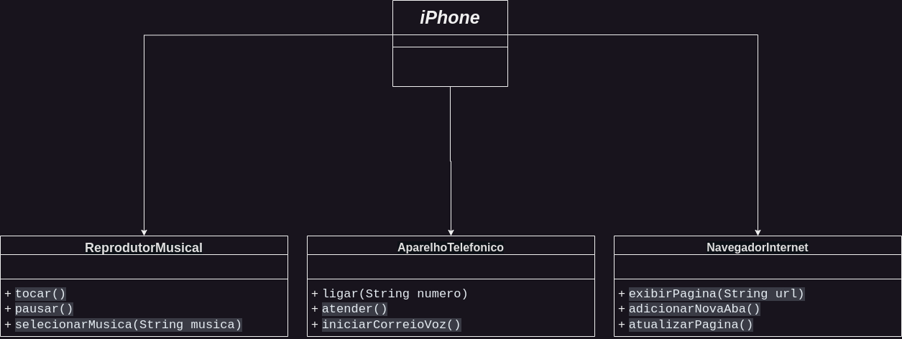

# UML

## POO - Desafio

### Modelagem e Diagramação de um Componente iPhone

Desafio responsável por modelar e diagramar a representação UML do componente iPhone, abrangendo suas funcionalidades como Reprodutor Musical, Aparelho Telefônico e Navegador na Internet.

## Author

[@wallacemillerdias](https://www.linkedin.com/in/wallacemillerdias/) – wallacemillerdias@gmail.com

